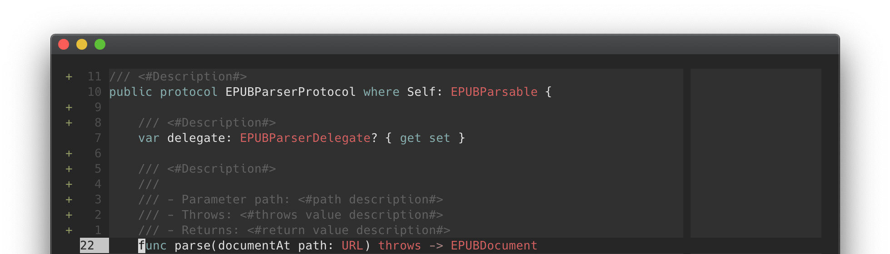

# vim-swiftdocstring
<p align=center>
<a href="">

</a>
</p>
<p align=center>
    <a href=""></a>
    <a href="https://twitter.com/witekbobrowski"></a>
</p>
<p align=center>
A simple vim/neovim plugin that provides Xcode-like docstring templates for Swift.
</p>

## Features

- 📑 Generate Swift docstrings for types, functions and properties
- 🎛 Support for `///` and `/** ... */` delimiters 
- 🎨 Even more customizable output
- 🔨 Xcode-like style of docstrings 
- 🧠 Context awarness that puts Xcode docstring generation to shame
- 🔥 Fast parsing using regular expressions
- 👌 Zero dependency (**100%** vim-script)

## Installation

##### vim-plug
```vim
Plug 'witekbobrowski/vim-swiftdocstring'
```

##### Vundle 
```vim
Plugin 'witekbobrowski/vim-swiftdocstring'
```

##### Dein
```vim
call dein#add('witekbobrowski/vim-swiftdocstring')
```

## Usage

##### Commands 
- `:SwiftDocstringCurrent`

    > Generates docstring for the context in the current line of the cursor

- `:SwiftDocstringTypes`

    > Generates docstrings for every type declaration in current buffer 

- `:SwiftDocstringFunctions`

    > Generates docstrings for every function declaration in current buffer

##### Mappings

For your own convenience add the following to your `.vimrc`
```vim
" Generate docstring for current context on 'Tab' + '/'
autocmd Filetype swift nnoremap <silent><tab>/ :SwiftDocstringCurrent<CR>
```

##### Options

For customized behaviour, change values of these properties. Values presented 
below are the defaults.
```vim
" Use Multi-line delimiter '/** ... */' instead of single-line '///'
" Boolen value (0 or 1)
let g:swiftdocstring#use_multi_line_delimiter = 0
```
```vim
" Set indentation for dosctring between the text and delimiters
" Integer value (>=0)
let g:swiftdocstring#text_indentation_level = 1
```
```vim
" Use placeholders for some components of the docstring 
" Boolen value (0 or 1)
let g:swiftdocstring#use_placeholders = 1
```
```vim
" Placeholders to be used if setting above is set as true 
" Two element string array
let g:swiftdocstring#placeholder_template = ['<#', '#>']
```

## Documentation

Everything you need to know about the usage of this plugin is basically here 
in this readme. Feel free to dive into the codebase for more answers. Very 
basic documentation is available from inside of vim itself with `:h` command.

```vim
:help swiftdocstring
```

## Why

This plugin was made under the desire to have a powerfull Swift development
envirionment in vim. Although the plugin brings only a small feature ported
from Xcode, I want to add at least one brick to the wall. This is as far as
I can go at the moment with the amount of time it took to create this peace 
of code. I intend it to remain simple, yet useful. Contributions are welcomed.

## Resources

To learn more about Swift docstrings read this awesome article at NSHipster:
[Swift Documentation](https://nshipster.com/swift-documentation/) 
> Swift Documentation
>
> Written by Nate Cook & Mattt — July 11th, 2018 (revised)


## License

The plugin in licensed under MIT license so do what ever you want with it.
